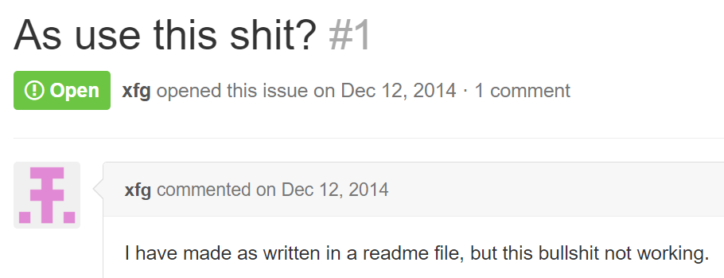
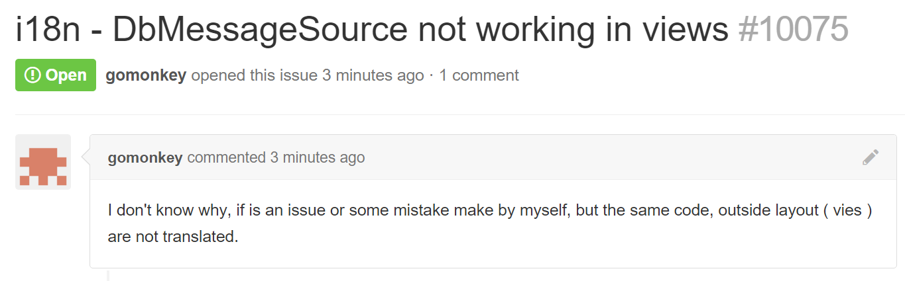
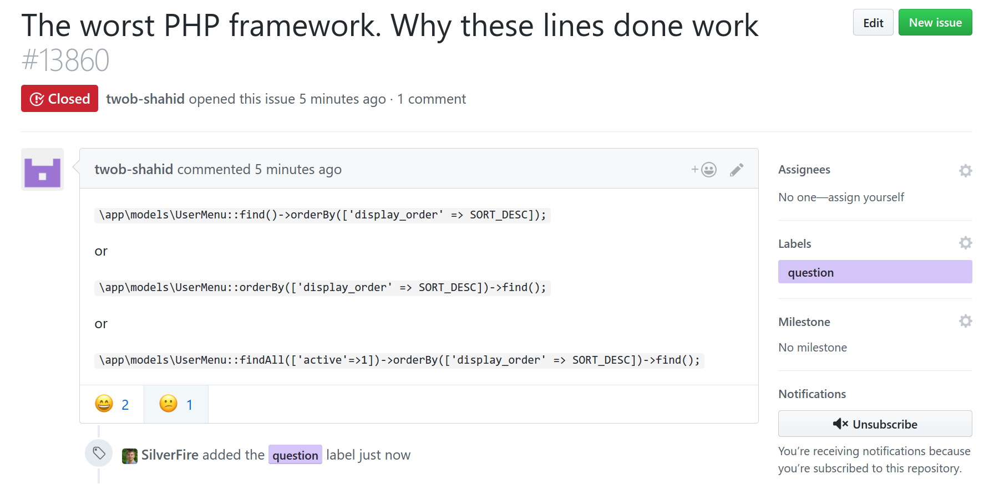
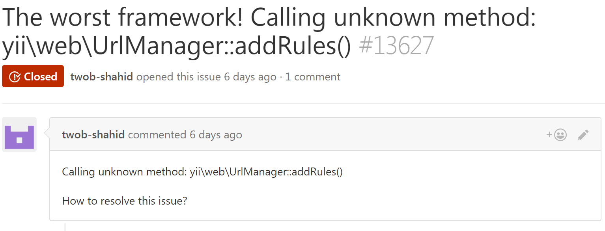
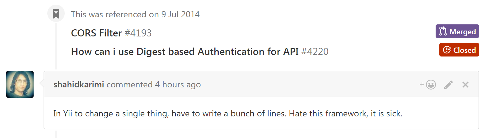
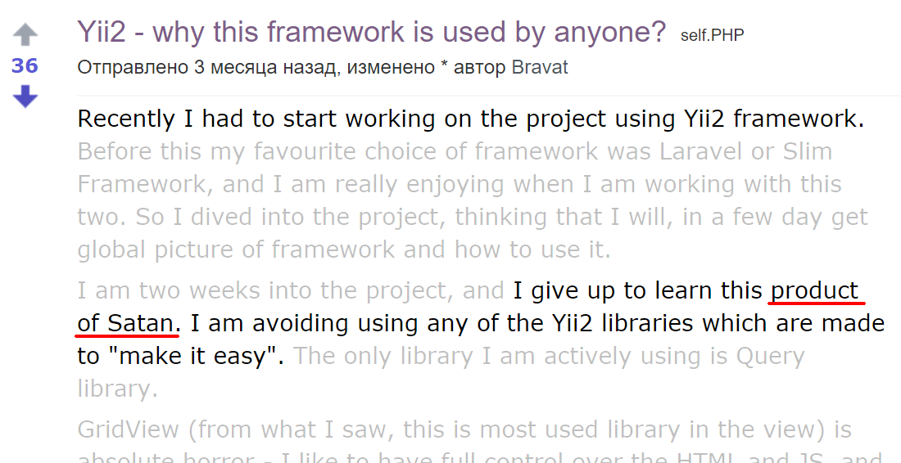
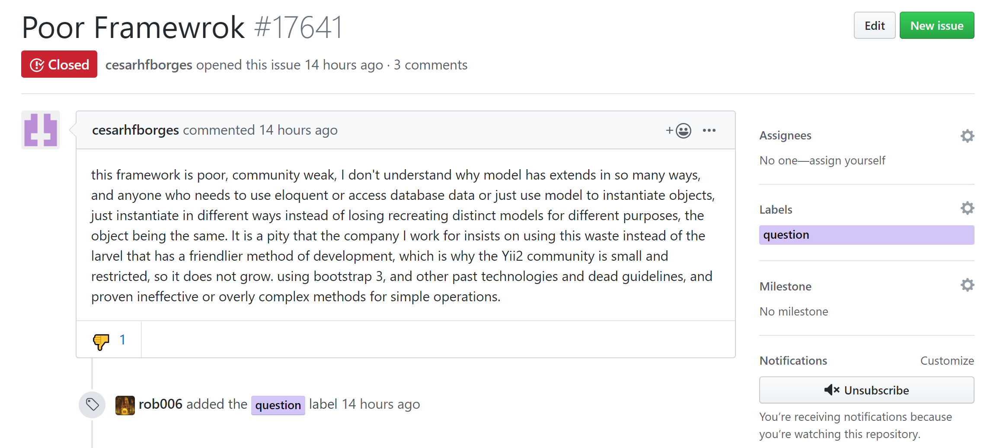
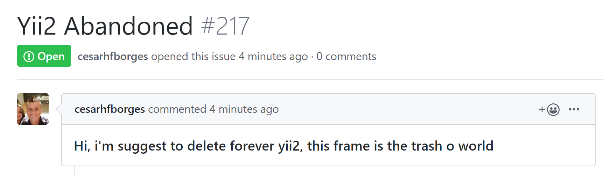

# Hate in OpenSource

OpenSource is a great movement but it could be hard for maintainer to keep
doing it. Why? Many reasons and haters is one of them.

In this repository I am sharing hilarious hate-post examples. The goal is to
show you that you aren't alone in this.

Hope you'll have a good laugh and keep doing good stuff.

If you have more to share either about Yii or another project, pull requests
are welcome.

## Yii framework

[Yii framework](https://www.yiiframework.com/) is one of the popular PHP
frameworks I am maintaining with more than 13K stars at GitHub and many users
all around the world. Such great adoption amplifies usual feedback OpenSource
maintainer is receiving. Of course, there are "thank you" messages but as
a maintainer you will definitely get some hate.

That's just "a bit" rude:

Not hate by itself but the kind of reports maintainers hate most. "Something isn't working".

What kind of response Shahid was expecting by prefixing issues with "The worst PHP framework"?

Likely the same person. I guess someone reported previous account to GitHub.

This [reddit thread](https://www.reddit.com/r/PHP/comments/3d4kcx/yii2_why_this_framework_is_used_by_anyone/) is gold!

This issue is at least... elaborative.

Nope, that won't be implemented...

